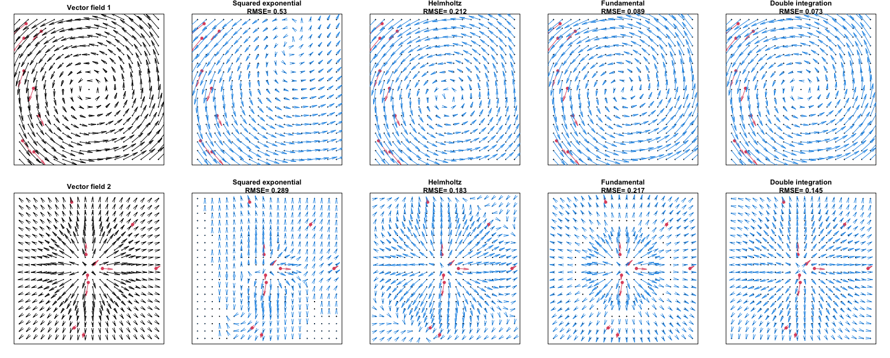

# Equivariant-Random-Fields
Code and data for the experimental results of the paper "integration free kernels for equivariant Gaussian process modelling".
The code is presented in an R markdown document at https://equivariantrf.github.io/Equivariant-Random-Fields/Notebook_equivariant_RFs.html. 

